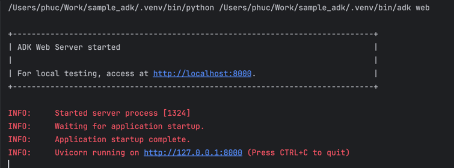
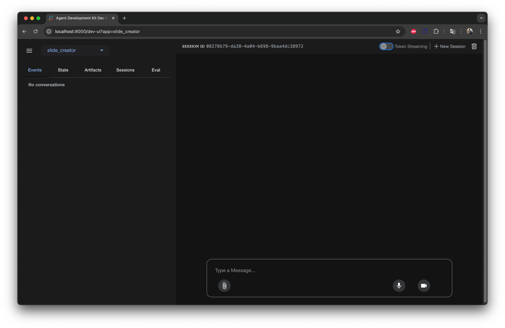

# Slide Composer Agent
This project uses the [Google Agent Development Kit (ADK)](https://google.github.io/adk-docs/) to build an AI-powered slide composer.

## Setup
### 1. Install dependencies
```bash
pip install -r requirements.txt
```
### 2. Create `.env` file
```text
GOOGLE_GENAI_USE_VERTEXAI=FALSE
GOOGLE_API_KEY=your_api_key_here
GOOGLE_GENAI_MODEL=gemini-2.0-flash
```

Replace `your_api_key_here` with your actual Google API key.

### 3.Run ADK Web UI
```shell
source .env
adk web
```



### 4. Open in browser
Go to: http://localhost:8000
Or
http://localhost:8000/dev-ui?app=slide_creator

Notes
 - Requires Python 3.9+
 - See ADK Docs for more info

## Example Output

View example slides comparing C vs C++: [View PDF](http://files.hocai.space/s/2CLa8JRbStGGXdz?dir=/&openfile=true)

